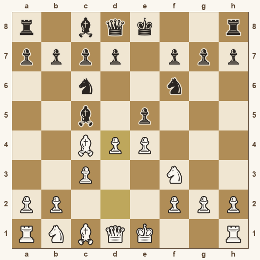
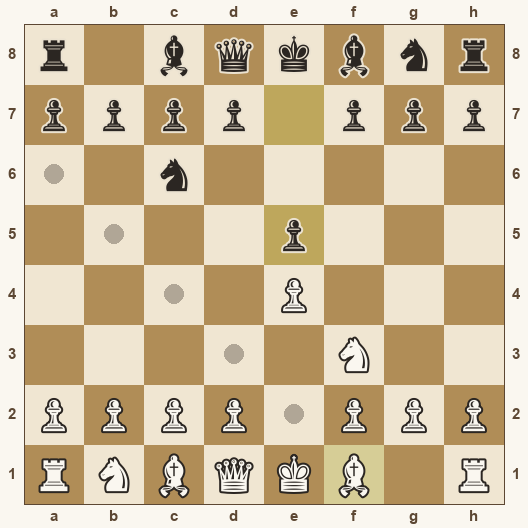
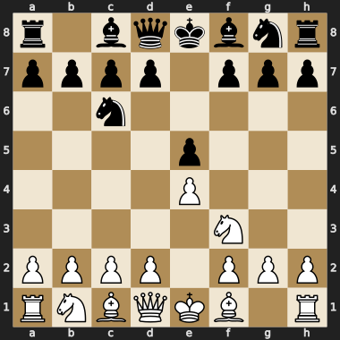
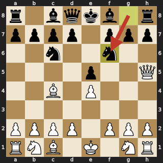
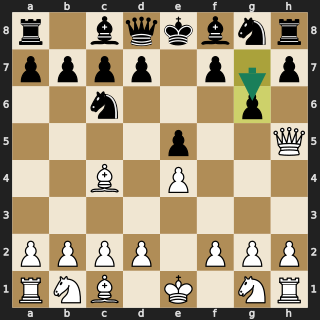

# Chess Tutor — an Explainable AI Coach

[](https://ai-chess-tutor-phnam05.streamlit.app/)

<p align="center">
  
</p>

A chess engine knows the best move — but it outputs a *number*, not an
explanation. This prototype builds the layer between "the machine knows" and
"the human understands": it takes a strong engine's analysis and turns it into
short, level-adapted coaching. The point isn't an AI that plays well, but one
that **explains its reasoning so people learn from it** — the subject of
Explainable AI (XAI).

## The core idea

**The engine decides the chess; the language model only explains it.**

- **Stockfish** determines the best move, evaluation, and predicted line —
  treated as ground truth.
- **Gemini** is given those facts and asked *only* to phrase them in natural
  language, adapted to the player's level. It never evaluates the position itself.

This separation is deliberate. Language models are unreliable at actually playing
chess — they hallucinate moves and miscount material. Grounding every explanation
in the engine's verified output keeps the tutor faithful to correct chess. The
model is a translator, not a player.

## Ways to use it

One screen: a click-to-move board you play on — for **both sides** — with the
coach watching every move, plus a **Show best move** button that reads whatever
position is on the board.

**Play a move.** Click a piece (its legal moves dot the board) and move it. The
coach grades it instantly: a quality label (*Best* → *Blunder*), the win-chance
swing, and the engine's preferred move when you missed it. For a weak move the
coaching leads with *why* it fails — walking the engine's **refutation**, the
punishing reply you overlooked — before naming the better move. That turns a
mistake into a targeted lesson rather than mere analysis.

<p align="center">
  
</p>

<p align="center"><em>Legal moves dot the board; the last move stays tinted. The coach grades every move, for both sides.</em></p>

**Show best move.** Ask the engine for the strongest move and its evaluation in
the current position, then have the coach put the reasoning into words — a hint
on demand, not a running spoiler.

<p align="center">
  
</p>

<p align="center"><em><strong>Show best move</strong> — here the engine's pick is <strong>Bb5</strong> (eval <strong>+0.32</strong>), which the coach explains at your chosen level.</em></p>

**The before/after comparison.** When a move is graded, two boards show your move
(arrowed in the verdict's colour) and the engine's best (green) side by side — so
the difference is visible, not just described.

<table align="center"><tr>
  <td align="center"><br><em>You played <strong>…Nf6</strong></em></td>
  <td align="center"><br><em>Engine's best, <strong>…g6</strong></em></td>
</tr></table>

<p align="center"><em>The natural <strong>…Nf6</strong> even attacks the queen, yet it's a <strong>Blunder</strong>: it allows Scholar's mate (Qxf7#), and the win chance falls from <strong>54% to 3%</strong>.</em></p>

**Set up any position.** The live board is shown beneath as a copyable FEN; edit
it and press *Load* to jump there and study a specific spot.

## How it works

```
Position (FEN)  [+ a played move, when you make one]
      │
      ▼
python-chess ──► Stockfish        →  best move, evaluation (centipawns),
   (rules,         (analysis)          principal variation; and, for a played
    board)                              move, its eval + refutation
      │
      ▼
Explanation layer (Gemini)        →  grounded, level-adapted coaching
      │                                (beginner / intermediate / advanced)
      ▼
Streamlit UI                      →  board + engine verdict + coaching
```

`python-chess` validates the position and queries Stockfish. For a played move it
also evaluates that move and captures the engine's line *after* it — the
refutation — so a weak move's punishment can be explained. Those facts are packaged
into a prompt with a system instruction that fixes a coach persona, forbids
suggesting a different move or inventing evaluations, and adapts depth to the level.

## Level adaptation

Same engine facts, explained differently:

- **Beginner** — one clear idea in plain words (development, king safety, simple
  threats); no jargon.
- **Intermediate** — plans, why a move creates pressure, typical responses.
- **Advanced** — pawn structure, the bishop pair, tempo, long-term imbalances.

## Tech stack

- **Python** + **Streamlit** (web interface)
- **Stockfish** — chess engine (off-the-shelf; not this project's contribution)
- **python-chess** — board, rules, FEN/PGN, engine communication, SVG rendering
- **Pillow** + **streamlit-image-coordinates** — render the clickable board to a
  PNG (no system libraries, so it's identical locally and on the Cloud) and turn a
  click into a square
- **Google Gemini** (`google-genai` SDK) — the explanation layer

## Running it locally

Requires Python 3.9+ and a free Google AI Studio API key.

```bash
# 1. Clone, then create a virtual environment
git clone https://github.com/YOUR_USERNAME/chess-tutor.git
cd chess-tutor
python -m venv venv
venv\Scripts\activate          # Windows  (source venv/bin/activate on macOS/Linux)

# 2. Install dependencies
pip install -r requirements.txt

# 3. Add the Stockfish engine — download from stockfishchess.org/download
#    and place it here as stockfish.exe (Windows)

# 4. Add your Gemini key at .streamlit/secrets.toml:
#    GOOGLE_API_KEY = "your_key_here"

# 5. Run
streamlit run app.py
```

On Streamlit Community Cloud, add the same `GOOGLE_API_KEY` line via the app's
**Settings → Secrets** panel instead of committing it.

## Project structure

```
engine_analysis.py    # Stage 1: queries Stockfish → facts (the backbone)
move_review.py        # grades a played move against the engine's best
explainer.py          # Stage 2: grounded, level-adapted explanation layer
engine_pool.py        # one shared, persistent Stockfish process + engine discovery
board_ui.py           # renders the clickable board + maps click → square
app.py                # Streamlit interface (analyze + play)
scripts/make_readme_images.py   # regenerates images/ from the app's own renderers
```

README images are produced by `python scripts/make_readme_images.py` using the
app's actual rendering code, so they stay honest to what the UI shows.

## Limitations

- Explanation polish depends on the language model; the architecture constrains
  *what* it can claim, not how well every sentence reads.
- The engine searches to a bounded depth (with a short time cap) for
  responsiveness — strong, but not exhaustive.
- Coaching is still per-move: no conversation across the game, no memory between
  sessions (see below).

## Future directions

- **Conversational dialogue.** Let the student ask "why?" or "what if?" and have
  the coach answer in context across the whole game — a real tutoring session, not
  one move at a time.
- **A learner model.** Track a player's moves to infer *characteristic* weaknesses
  (e.g. missing tactical defenses) and shape explanations around the recurring gap.
  Inferring a learner's hidden understanding from behaviour parallels inferring an
  agent's hidden type from its actions — a well-studied multi-agent problem, which
  makes this a principled next step.
- **Beyond board games.** The same architecture — ground an explanation in an
  authoritative source, then adapt it to the learner — transfers to decision
  problems with *no* clean evaluation function (e.g. coaching a physical skill from
  video, like badminton footage with pose estimation), moving into computer vision
  while keeping the explainable-tutor goal intact.

## Why this project

A demonstration of explainable AI for complex decision-making: an AI that improves
human skill rather than replacing it. Chess was chosen for its clean, verifiable
engine and because the author knows it well enough to judge whether the
explanations are genuinely good — letting the work focus on the explanation and
adaptation layer, the transferable, research-relevant contribution.
